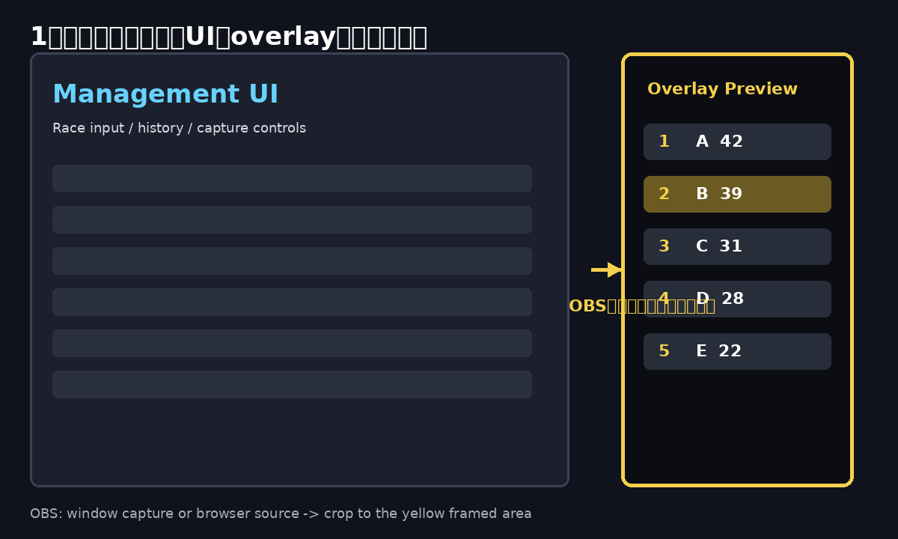

# 使い方

## 1. アプリを開く

ローカル確認:

```bash
python3 -m http.server 8000
```

```text
http://localhost:8000/
```

公開後はGitHub PagesまたはCloudflare PagesのURLを開きます。

## 2. OBS用overlayを設定する

アプリ右側に `Overlay Preview` があります。

OBSでは以下のどちらかで使います。

- ブラウザ画面をウィンドウキャプチャし、`Overlay Preview` 部分だけクロップする
- OBSブラウザソースでアプリURLを開き、`Overlay Preview` 部分だけクロップする

クロップのイメージ:



## 3. 1レース目を入力する

1レース目はOCRしません。

1位〜12位のタグを手入力し、`Add Race` を押します。

## 4. 画面共有を開始する

`Start` を押して、OBSまたはゲーム画面を選択します。

画面共有中のライブ映像は管理画面には表示されません。

リザルト画面が検出されると、その時点のスクリーンショットが表示されます。このスクリーンショットは確認が終わるまで上書きされません。

## 5. 自動判定の準備が完了する

1レース目の手入力結果と、検出されたリザルト画面が揃うと、2レース目以降の自動判定準備が完了します。

手入力が先でも、リザルト検出が先でも、両方が揃った時点で自動的に準備されます。

準備完了後は、同じリザルトをもう一度処理しないようにしばらく次のレースを待ちます。

## 6. 2レース目以降

準備完了後に次のリザルト画面が検出されると、検出結果が表示されます。

内容を確認し、問題なければ `Add Detected Race` を押します。

間違いがある場合は、Race Historyでタグを修正してください。修正するとoverlayも即更新されます。

## 7. リセット

新しく集計し直す場合は `Reset All` を押します。

保存データ、レース履歴、自動判定用データ、自チーム設定が削除されます。
